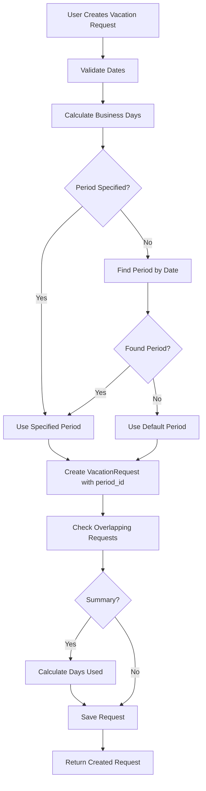
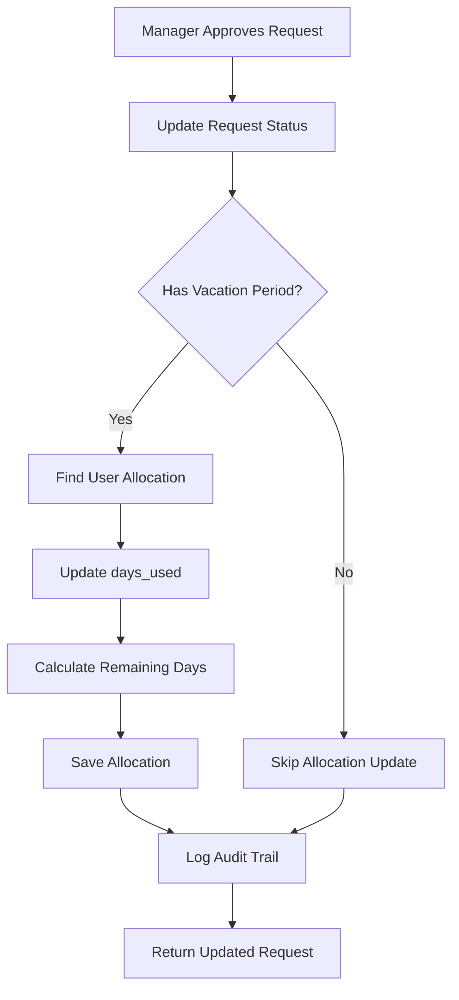

# Vacation Planner - Multi-Period Support Design Document

## 1. Overview

This document outlines the database schema changes required to support:
- Multiple vacation periods per user per cavaction year
- Admin-configurable vacation year dates (default: 1 April - 31 March)
- Display of total vacation days per vacation year

## 2. Current State Analysis

### Existing Models
- [`User`](backend/app/models.py:135) - Employee model with id, email, company_id, role
- [`VacationRequest`](backend/app/models.py:227) - Vacation request with start_date, end_date, status, vacation_type
- [`Company`](backend/app/models.py:70) - Multi-tenant isolation
- [`Team`](backend/app/models.py:112) - Team grouping

### Current Limitations
1. No vacation period concept exists
2. No allocation tracking (total days per year)
3. No carried over days tracking
4. No days_used tracking per period

## 3. New Data Models

### 3.1 VacationPeriod Model

Defines vacation year boundaries for each company.

```python
# Add to backend/app/models.py

class VacationPeriod(Base):
    """Vacation period model - defines vacation year boundaries per company."""
    __tablename__ = "vacation_periods"
    
    id: Mapped[uuid.UUID] = mapped_column(StringUUID, primary_key=True, default=uuid.uuid4)
    company_id: Mapped[uuid.UUID] = mapped_column(
        StringUUID, ForeignKey("companies.id", ondelete="CASCADE"), nullable=False
    )
    name: Mapped[str] = mapped_column(String(100), nullable=False)  # e.g., "2024-2025"
    start_date: Mapped[date] = mapped_column(Date, nullable=False)
    end_date: Mapped[date] = mapped_column(Date, nullable=False)
    is_default: Mapped[bool] = mapped_column(Boolean, default=False)  # Default for new allocations
    is_active: Mapped[bool] = mapped_column(Boolean, default=True)
    created_at: Mapped[datetime] = mapped_column(DateTime(timezone=True), server_default=func.now())
    updated_at: Mapped[datetime] = mapped_column(DateTime(timezone=True), server_default=func.now(), onupdate=func.now())
    
    # Relationships
    company: Mapped["Company"] = relationship("Company", back_populates="vacation_periods")
    allocations: Mapped[list["VacationAllocation"]] = relationship("VacationAllocation", back_populates="vacation_period")
    vacation_requests: Mapped[list["VacationRequest"]] = relationship("VacationRequest", back_populates="vacation_period")
    
    # Indexes
    __table_args__ = (
        Index("idx_vp_company_dates", "company_id", "start_date", "end_date"),
        Index("idx_vp_default", "company_id", "is_default"),
        UniqueConstraint("company_id", "name", name="uq_company_period_name"),
    )
    
    @property
    def year_label(self) -> str:
        """Return human-readable year label."""
        return f"{self.start_date.year}-{self.end_date.year}"
```

### 3.2 VacationAllocation Model

Tracks vacation days allocated to users per period.

```python
class VacationAllocation(Base):
    """Vacation allocation model - tracks user's vacation days per period."""
    __tablename__ = "vacation_allocations"
    
    id: Mapped[uuid.UUID] = mapped_column(StringUUID, primary_key=True, default=uuid.uuid4)
    user_id: Mapped[uuid.UUID] = mapped_column(
        StringUUID, ForeignKey("users.id", ondelete="CASCADE"), nullable=False
    )
    vacation_period_id: Mapped[uuid.UUID] = mapped_column(
        StringUUID, ForeignKey("vacation_periods.id", ondelete="CASCADE"), nullable=False
    )
    total_days: Mapped[int] = mapped_column(Integer, nullable=False, default=25)  # Standard allocation
    carried_over_days: Mapped[int] = mapped_column(Integer, default=0)  # Days from previous period
    days_used: Mapped[int] = mapped_column(Integer, default=0)  # Days used in approved requests
    notes: Mapped[Optional[str]] = mapped_column(Text, nullable=True)
    created_at: Mapped[datetime] = mapped_column(DateTime(timezone=True), server_default=func.now())
    updated_at: Mapped[datetime] = mapped_column(DateTime(timezone=True), server_default=func.now(), onupdate=func.now())
    
    # Relationships
    user: Mapped["User"] = relationship("User", back_populates="vacation_allocations")
    vacation_period: Mapped["VacationPeriod"] = relationship("VacationPeriod", back_populates="allocations")
    
    # Indexes
    __table_args__ = (
        UniqueConstraint("user_id", "vacation_period_id", name="uq_user_period_allocation"),
        Index("idx_va_user", "user_id"),
        Index("idx_va_period", "vacation_period_id"),
    )
    
    @property
    def remaining_days(self) -> int:
        """Calculate remaining vacation days."""
        return self.total_days + self.carried_over_days - self.days_used
    
    @property
    def total_available(self) -> int:
        """Calculate total available days including carried over."""
        return self.total_days + self.carried_over_days
```

### 3.3 Updated VacationRequest Model

Add fields to track vacation period and calculated days.

```python
# Update VacationRequest class in backend/app/models.py

class VacationRequest(Base):
    """Vacation request model - updated with period tracking."""
    __tablename__ = "vacation_requests"
    
    # ... existing fields ...
    
    # NEW FIELDS ADDED:
    vacation_period_id: Mapped[Optional[uuid.UUID]] = mapped_column(
        StringUUID, ForeignKey("vacation_periods.id", ondelete="SET NULL"), nullable=True
    )
    days_count: Mapped[int] = mapped_column(Integer, default=0)  # Calculated business days
    
    # Relationships - ADD:
    vacation_period: Mapped[Optional["VacationPeriod"]] = relationship(
        "VacationPeriod", back_populates="vacation_requests"
    )
    
    # Update indexes
    __table_args__ = (
        # ... existing indexes ...
        Index("idx_vr_period", "vacation_period_id"),
    )
```

### 3.4 Updated User Model

Add relationship to VacationAllocation.

```python
# Update User class in backend/app/models.py

class User(Base):
    """User model - updated with vacation allocation relationship."""
    # ... existing fields ...
    
    # ADD new relationship:
    vacation_allocations: Mapped[list["VacationAllocation"]] = relationship(
        "VacationAllocation", back_populates="user", cascade="all, delete-orphan"
    )
```

### 3.5 Updated Company Model

Add relationship to VacationPeriod.

```python
# Update Company class in backend/app/models.py

class Company(Base):
    """Company model - updated with vacation period relationship."""
    # ... existing fields ...
    
    # ADD new relationship:
    vacation_periods: Mapped[list["VacationPeriod"]] = relationship(
        "VacationPeriod", back_populates="company", cascade="all, delete-orphan"
    )
```

## 4. Pydantic Schemas

### 4.1 VacationPeriod Schemas

```python
# Add to backend/app/schemas.py

class VacationPeriodBase(BaseModel):
    """Base schema for vacation period."""
    name: str = Field(..., min_length=1, max_length=100)
    start_date: date
    end_date: date
    is_default: bool = False
    is_active: bool = True


class VacationPeriodCreate(VacationPeriodBase):
    """Schema for creating a vacation period."""
    company_id: UUID
    
    @model_validator(mode='before')
    @classmethod
    def validate_dates(cls, data):
        if isinstance(data, dict):
            if data.get('end_date') <= data.get('start_date'):
                raise ValueError("end_date must be after start_date")
        return data


class VacationPeriodUpdate(BaseModel):
    """Schema for updating a vacation period."""
    name: Optional[str] = Field(None, min_length=1, max_length=100)
    start_date: Optional[date] = None
    end_date: Optional[date] = None
    is_default: Optional[bool] = None
    is_active: Optional[bool] = None


class VacationPeriodResponse(VacationPeriodBase):
    """Schema for vacation period response."""
    model_config = ConfigDict(from_attributes=True)
    
    id: UUID
    company_id: UUID
    created_at: datetime
    updated_at: datetime


class VacationPeriodWithStatsResponse(VacationPeriodResponse):
    """Schema for vacation period with allocation statistics."""
    total_allocations: int
    total_days_allocated: int
    total_days_used: int
```

### 4.2 VacationAllocation Schemas

```python
class VacationAllocationBase(BaseModel):
    """Base schema for vacation allocation."""
    user_id: UUID
    vacation_period_id: UUID
    total_days: int = Field(default=25, ge=0, le=365)
    carried_over_days: int = Field(default=0, ge=0, le=365)
    notes: Optional[str] = None


class VacationAllocationCreate(VacationAllocationBase):
    """Schema for creating a vacation allocation."""


class VacationAllocationUpdate(BaseModel):
    """Schema for updating a vacation allocation."""
    total_days: Optional[int] = Field(None, ge=0, le=365)
    carried_over_days: Optional[int] = Field(None, ge=0, le=365)
    notes: Optional[str] = None


class VacationAllocationResponse(BaseModel):
    """Schema for vacation allocation response."""
    model_config = ConfigDict(from_attributes=True)
    
    id: UUID
    user_id: UUID
    vacation_period_id: UUID
    total_days: int
    carried_over_days: int
    days_used: int
    remaining_days: int
    total_available: int
    notes: Optional[str]
    created_at: datetime
    updated_at: datetime
    vacation_period: Optional[VacationPeriodResponse] = None


class VacationAllocationWithUserResponse(BaseModel):
    """Schema for vacation allocation with user info."""
    model_config = ConfigDict(from_attributes=True)
    
    id: UUID
    user_id: UUID
    vacation_period_id: UUID
    total_days: int
    carried_over_days: int
    days_used: int
    remaining_days: int
    total_available: int
    notes: Optional[str]
    created_at: datetime
    updated_at: datetime
    user: Optional[UserResponse] = None
    vacation_period: Optional[VacationPeriodResponse] = None
```

### 4.3 Updated VacationRequest Schemas

```python
# Update VacationRequestCreate in backend/app/schemas.py

class VacationRequestCreate(BaseModel):
    """Vacation request create schema - updated."""
    start_date: date
    end_date: date
    vacation_type: str = "annual"
    reason: Optional[str] = None
    team_id: Optional[UUID] = None
    vacation_period_id: Optional[UUID] = None  # Optional - auto-determined if not provided
    
    @field_validator('vacation_type', 'reason')
    @classmethod
    def sanitize_text_fields(cls, v: Optional[str]) -> Optional[str]:
        return sanitize_optional_input(v)
    
    @model_validator(mode='before')
    @classmethod
    def validate_dates(cls, data):
        if isinstance(data, dict):
            if data.get('end_date') < data.get('start_date'):
                raise ValueError("end_date must be after or equal to start_date")
        return data


# Add to VacationRequestResponse
class VacationRequestResponse(BaseModel):
    """Vacation request response schema - updated."""
    model_config = ConfigDict(from_attributes=True)
    
    id: UUID
    user_id: UUID
    team_id: Optional[UUID]
    start_date: date
    end_date: date
    vacation_type: str
    status: VacationStatus
    reason: Optional[str]
    approver_id: Optional[UUID]
    approved_at: Optional[datetime]
    created_at: datetime
    updated_at: datetime
    # NEW FIELDS:
    vacation_period_id: Optional[UUID]
    days_count: int
    user: Optional[UserResponse] = None
    vacation_period: Optional[VacationPeriodResponse] = None


class VacationBalanceResponse(BaseModel):
    """Schema for user's vacation balance per period."""
    user_id: UUID
    vacation_period_id: UUID
    vacation_period_name: str
    total_days: int
    carried_over_days: int
    days_used: int
    remaining_days: int
    pending_days: int  # Days in pending requests
```

## 5. Business Logic

### 5.1 Business Day Calculator

```python
# backend/app/vacation_utils.py

from datetime import date, timedelta
from typing import Optional


def calculate_business_days(start_date: date, end_date: date) -> int:
    """Calculate business days between two dates (excludes weekends).
    
    Args:
        start_date: Start date of vacation
        end_date: End date of vacation
        
    Returns:
        Number of business days
    """
    if start_date > end_date:
        return 0
    
    # Count business days (Monday=0, Sunday=6)
    business_days = 0
    current = start_date
    
    while current <= end_date:
        if current.weekday() < 5:  # Monday to Friday
            business_days += 1
        current += timedelta(days=1)
    
    return business_days


def get_vacation_period_for_date(
    date: date, 
    periods: list[VacationPeriod]
) -> Optional[VacationPeriod]:
    """Find the vacation period that contains the given date.
    
    Args:
        date: The date to find period for
        periods: List of vacation periods
        
    Returns:
        Matching vacation period or None
    """
    for period in periods:
        if period.start_date <= date <= period.end_date:
            return period
    return None


def get_default_vacation_period(periods: list[VacationPeriod]) -> Optional[VacationPeriod]:
    """Get the default vacation period.
    
    Args:
        periods: List of vacation periods
        
    Returns:
        Default period or first active period
    """
    for period in periods:
        if period.is_default:
            return period
    
    # Fall back to first active period
    for period in periods:
        if period.is_active:
            return period
    
    return None
```

### 5.2 Auto-Determine Vacation Period

```python
# In vacation_requests.py create endpoint

async def get_or_create_vacation_period(
    db: AsyncSession,
    company_id: UUID,
    request_date: date
) -> VacationPeriod:
    """Get or auto-determine vacation period for a date."""
    # Get all active periods for company
    periods = await db.execute(
        select(VacationPeriod).where(
            and_(
                VacationPeriod.company_id == company_id,
                VacationPeriod.is_active == True
            )
        )
    )
    periods_list = periods.scalars().all()
    
    # Try to find matching period
    period = get_vacation_period_for_date(request_date, periods_list)
    if period:
        return period
    
    # Create default period if none exists
    if not periods_list:
        year = request_date.year
        # Default: April 1 - March 31
        default_period = VacationPeriod(
            company_id=company_id,
            name=f"{year}-{year+1}",
            start_date=date(year, 4, 1),
            end_date=date(year + 1, 3, 31),
            is_default=True,
            is_active=True
        )
        db.add(default_period)
        await db.flush()
        return default_period
    
    return get_default_vacation_period(periods_list)
```

### 5.3 Update Days Used on Approval

```python
async def update_allocation_on_approval(
    db: AsyncSession,
    vacation_request: VacationRequest
):
    """Update allocation days_used when request is approved."""
    if not vacation_request.vacation_period_id:
        return
    
    # Find allocation
    allocation = await db.execute(
        select(VacationAllocation).where(
            and_(
                VacationAllocation.user_id == vacation_request.user_id,
                VacationAllocation.vacation_period_id == vacation_request.vacation_period_id
            )
        )
    )
    allocation = allocation.scalar_one_or_none()
    
    if allocation:
        allocation.days_used += vacation_request.days_count
        await db.commit()


async def update_allocation_on_rejection(
    db: AsyncSession,
    vacation_request: VacationRequest
):
    """Update allocation days_used when request is rejected/cancelled."""
    if not vacation_request.vacation_period_id:
        return
    
    allocation = await db.execute(
        select(VacationAllocation).where(
            and_(
                VacationAllocation.user_id == vacation_request.user_id,
                VacationAllocation.vacation_period_id == vacation_request.vacation_period_id
            )
        )
    )
    allocation = allocation.scalar_one_or_none()
    
    if allocation:
        allocation.days_used -= vacation_request.days_count
        await db.commit()
```

## 6. Admin API Endpoints

### 6.1 Vacation Period Endpoints

```python
# Add to backend/app/routers/admin.py

@router.post("/vacation-periods", response_model=VacationPeriodResponse)
async def create_vacation_period(
    request: VacationPeriodCreate,
    current_user: User = Depends(require_role(UserRole.ADMIN)),
    db: AsyncSession = Depends(get_db)
):
    """Admin: Create a new vacation period."""
    # Verify company exists
    company = await db.execute(select(Company).where(Company.id == request.company_id))
    if not company.scalar_one_or_none():
        raise HTTPException(status_code=404, detail="Company not found")
    
    # If setting as default, unset other defaults
    if request.is_default:
        await db.execute(
            update(VacationPeriod)
            .where(VacationPeriod.company_id == request.company_id)
            .values(is_default=False)
        )
    
    period = VacationPeriod(**request.model_dump())
    db.add(period)
    await db.commit()
    await db.refresh(period)
    
    return period


@router.get("/vacation-periods", response_model=list[VacationPeriodResponse])
async def list_vacation_periods(
    company_id: Optional[UUID] = None,
    current_user: User = Depends(require_role(UserRole.ADMIN)),
    db: AsyncSession = Depends(get_db)
):
    """Admin: List vacation periods."""
    query = select(VacationPeriod)
    if company_id:
        query = query.where(VacationPeriod.company_id == company_id)
    result = await db.execute(query.order_by(VacationPeriod.start_date))
    return result.scalars().all()


@router.get("/vacation-periods/{period_id}", response_model=VacationPeriodResponse)
async def get_vacation_period(
    period_id: UUID,
    current_user: User = Depends(require_role(UserRole.ADMIN)),
    db: AsyncSession = Depends(get_db)
):
    """Admin: Get vacation period by ID."""
    period = await db.execute(select(VacationPeriod).where(VacationPeriod.id == period_id))
    period = period.scalar_one_or_none()
    if not period:
        raise HTTPException(status_code=404, detail="Vacation period not found")
    return period


@router.put("/vacation-periods/{period_id}", response_model=VacationPeriodResponse)
async def update_vacation_period(
    period_id: UUID,
    update: VacationPeriodUpdate,
    current_user: User = Depends(require_role(UserRole.ADMIN)),
    db: AsyncSession = Depends(get_db)
):
    """Admin: Update a vacation period."""
    period = await db.execute(select(VacationPeriod).where(VacationPeriod.id == period_id))
    period = period.scalar_one_or_none()
    if not period:
        raise HTTPException(status_code=404, detail="Vacation period not found")
    
    update_data = update.model_dump(exclude_unset=True)
    
    # Handle default flag change
    if update_data.get('is_default') is True:
        await db.execute(
            update(VacationPeriod)
            .where(
                and_(
                    VacationPeriod.company_id == period.company_id,
                    VacationPeriod.id != period_id
                )
            )
            .values(is_default=False)
        )
    
    for field, value in update_data.items():
        setattr(period, field, value)
    
    await db.commit()
    await db.refresh(period)
    return period


@router.delete("/vacation-periods/{period_id}")
async def delete_vacation_period(
    period_id: UUID,
    current_user: User = Depends(require_role(UserRole.ADMIN)),
    db: AsyncSession = Depends(get_db)
):
    """Admin: Delete a vacation period (soft delete by setting is_active=False)."""
    period = await db.execute(select(VacationPeriod).where(VacationPeriod.id == period_id))
    period = period.scalar_one_or_none()
    if not period:
        raise HTTPException(status_code=404, detail="Vacation period not found")
    
    period.is_active = False
    await db.commit()
    
    return {"message": "Vacation period deactivated"}
```

### 6.2 Vacation Allocation Endpoints

```python
@router.post("/allocations", response_model=VacationAllocationResponse)
async def create_allocation(
    request: VacationAllocationCreate,
    current_user: User = Depends(require_role(UserRole.ADMIN)),
    db: AsyncSession = Depends(get_db)
):
    """Admin: Create a vacation allocation for a user."""
    # Verify user exists
    user = await db.execute(select(User).where(User.id == request.user_id))
    if not user.scalar_one_or_none():
        raise HTTPException(status_code=404, detail="User not found")
    
    # Verify period exists
    period = await db.execute(
        select(VacationPeriod).where(VacationPeriod.id == request.vacation_period_id)
    )
    if not period.scalar_one_or_none():
        raise HTTPException(status_code=404, detail="Vacation period not found")
    
    # Check for existing allocation
    existing = await db.execute(
        select(VacationAllocation).where(
            and_(
                VacationAllocation.user_id == request.user_id,
                VacationAllocation.vacation_period_id == request.vacation_period_id
            )
        )
    )
    if existing.scalar_one_or_none():
        raise HTTPException(status_code=400, detail="Allocation already exists for this user and period")
    
    allocation = VacationAllocation(**request.model_dump())
    db.add(allocation)
    await db.commit()
    await db.refresh(allocation)
    
    return allocation


@router.get("/allocations", response_model=list[VacationAllocationWithUserResponse])
async def list_allocations(
    user_id: Optional[UUID] = None,
    period_id: Optional[UUID] = None,
    company_id: Optional[UUID] = None,
    current_user: User = Depends(require_role(UserRole.ADMIN)),
    db: AsyncSession = Depends(get_db)
):
    """Admin: List vacation allocations with filters."""
    query = select(VacationAllocation).options(
        selectinload(VacationAllocation.user),
        selectinload(VacationAllocation.vacation_period)
    )
    
    if user_id:
        query = query.where(VacationAllocation.user_id == user_id)
    if period_id:
        query = query.where(VacationAllocation.vacation_period_id == period_id)
    if company_id:
        query = query.join(VacationPeriod).where(VacationPeriod.company_id == company_id)
    
    result = await db.execute(query.order_by(VacationAllocation.created_at))
    return result.scalars().all()


@router.get("/allocations/{allocation_id}", response_model=VacationAllocationResponse)
async def get_allocation(
    allocation_id: UUID,
    current_user: User = Depends(require_role(UserRole.ADMIN)),
    db: AsyncSession = Depends(get_db)
):
    """Admin: Get allocation by ID."""
    allocation = await db.execute(
        select(VacationAllocation).where(VacationAllocation.id == allocation_id)
    )
    allocation = allocation.scalar_one_or_none()
    if not allocation:
        raise HTTPException(status_code=404, detail="Allocation not found")
    return allocation


@router.put("/allocations/{allocation_id}", response_model=VacationAllocationResponse)
async def update_allocation(
    allocation_id: UUID,
    update: VacationAllocationUpdate,
    current_user: User = Depends(require_role(UserRole.ADMIN)),
    db: AsyncSession = Depends(get_db)
):
    """Admin: Update a vacation allocation."""
    allocation = await db.execute(
        select(VacationAllocation).where(VacationAllocation.id == allocation_id)
    )
    allocation = allocation.scalar_one_or_none()
    if not allocation:
        raise HTTPException(status_code=404, detail="Allocation not found")
    
    update_data = update.model_dump(exclude_unset=True)
    for field, value in update_data.items():
        setattr(allocation, field, value)
    
    await db.commit()
    await db.refresh(allocation)
    return allocation


@router.delete("/allocations/{allocation_id}")
async def delete_allocation(
    allocation_id: UUID,
    current_user: User = Depends(require_role(UserRole.ADMIN)),
    db: AsyncSession = Depends(get_db)
):
    """Admin: Delete a vacation allocation."""
    allocation = await db.execute(
        select(VacationAllocation).where(VacationAllocation.id == allocation_id)
    )
    allocation = allocation.scalar_one_or_none()
    if not allocation:
        raise HTTPException(status_code=404, detail="Allocation not found")
    
    await db.delete(allocation)
    await db.commit()
    
    return {"message": "Allocation deleted"}
```

### 6.3 User Vacation Balance Endpoint

```python
@router.get("/users/{user_id}/vacation-balance", response_model=list[VacationBalanceResponse])
async def get_user_vacation_balance(
    user_id: UUID,
    period_id: Optional[UUID] = None,
    current_user: User = Depends(require_role(UserRole.ADMIN)),
    db: AsyncSession = Depends(get_db)
):
    """Admin: Get user's vacation balance for specified or all periods."""
    # Verify user exists
    user = await db.execute(select(User).where(User.id == user_id))
    if not user.scalar_one_or_none():
        raise HTTPException(status_code=404, detail="User not found")
    
    # Get allocations
    query = select(VacationAllocation).options(
        selectinload(VacationAllocation.vacation_period)
    ).where(VacationAllocation.user_id == user_id)
    
    if period_id:
        query = query.where(VacationAllocation.vacation_period_id == period_id)
    
    result = await db.execute(query)
    allocations = result.scalars().all()
    
    # Calculate pending days
    pending_requests = await db.execute(
        select(VacationRequest).where(
            and_(
                VacationRequest.user_id == user_id,
                VacationRequest.status == VacationStatus.PENDING
            )
        )
    )
    pending_days_by_period = {}
    for req in pending_requests.scalars().all():
        if req.vacation_period_id:
            if req.vacation_period_id not in pending_days_by_period:
                pending_days_by_period[req.vacation_period_id] = 0
            pending_days_by_period[req.vacation_period_id] += req.days_count
    
    # Build response
    balances = []
    for allocation in allocations:
        balances.append(VacationBalanceResponse(
            user_id=user_id,
            vacation_period_id=allocation.vacation_period_id,
            vacation_period_name=allocation.vacation_period.name,
            total_days=allocation.total_days,
            carried_over_days=allocation.carried_over_days,
            days_used=allocation.days_used,
            remaining_days=allocation.remaining_days,
            pending_days=pending_days_by_period.get(allocation.vacation_period_id, 0)
        ))
    
    return balances
```

### 6.4 User's Own Balance Endpoint

```python
# Add to users.py router

@router.get("/me/vacation-balance", response_model=list[VacationBalanceResponse])
async def get_my_vacation_balance(
    period_id: Optional[UUID] = None,
    current_user: User = Depends(get_current_user),
    db: AsyncSession = Depends(get_db)
):
    """Get current user's vacation balance."""
    query = select(VacationAllocation).options(
        selectinload(VacationAllocation.vacation_period)
    ).where(VacationAllocation.user_id == current_user.id)
    
    if period_id:
        query = query.where(VacationAllocation.vacation_period_id == period_id)
    
    result = await db.execute(query)
    allocations = result.scalars().all()
    
    # Calculate pending days
    pending_requests = await db.execute(
        select(VacationRequest).where(
            and_(
                VacationRequest.user_id == current_user.id,
                VacationRequest.status == VacationStatus.PENDING
            )
        )
    )
    pending_days_by_period = {}
    for req in pending_requests.scalars().all():
        if req.vacation_period_id:
            if req.vacation_period_id not in pending_days_by_period:
                pending_days_by_period[req.vacation_period_id] = 0
            pending_days_by_period[req.vacation_period_id] += req.days_count
    
    balances = []
    for allocation in allocations:
        balances.append(VacationBalanceResponse(
            user_id=current_user.id,
            vacation_period_id=allocation.vacation_period_id,
            vacation_period_name=allocation.vacation_period.name,
            total_days=allocation.total_days,
            carried_over_days=allocation.carried_over_days,
            days_used=allocation.days_used,
            remaining_days=allocation.remaining_days,
            pending_days=pending_days_by_period.get(allocation.vacation_period_id, 0)
        ))
    
    return balances
```

## 7. Database Migration Steps

### Alembic Migration Script

```python
# backend/app/migrations/versions/002_add_vacation_periods.py

"""add_vacation_periods

Revision ID: 002
Revises: 001
Create Date: 2024-01-15 12:00:00

"""
from alembic import op
import uuid
from datetime import date
from sqlalchemy import Date, Integer, Boolean, Text, ForeignKey
from sqlalchemy.orm import relationship
from sqlalchemy import String, StringUUID


# revision identifiers
revision = '002'
down_revision = '001'
branch_labels = None
depends_on = None


def upgrade():
    # Create vacation_periods table
    op.create_table(
        'vacation_periods',
        sa.Column('id', StringUUID(), primary_key=True, default=uuid.uuid4),
        sa.Column('company_id', StringUUID(), ForeignKey('companies.id', ondelete='CASCADE'), nullable=False),
        sa.Column('name', String(100), nullable=False),
        sa.Column('start_date', Date(), nullable=False),
        sa.Column('end_date', Date(), nullable=False),
        sa.Column('is_default', Boolean(), default=False),
        sa.Column('is_active', Boolean(), default=True),
        sa.Column('created_at', sa.DateTime(timezone=True), server_default=sa.func.now()),
        sa.Column('updated_at', sa.DateTime(timezone=True), server_default=sa.func.now(), onupdate=sa.func.now()),
    )
    
    op.create_index('idx_vp_company_dates', 'vacation_periods', ['company_id', 'start_date', 'end_date'])
    op.create_index('idx_vp_default', 'vacation_periods', ['company_id', 'is_default'])
    op.create_unique_constraint('uq_company_period_name', 'vacation_periods', ['company_id', 'name'])
    
    # Create vacation_allocations table
    op.create_table(
        'vacation_allocations',
        sa.Column('id', StringUUID(), primary_key=True, default=uuid.uuid4),
        sa.Column('user_id', StringUUID(), ForeignKey('users.id', ondelete='CASCADE'), nullable=False),
        sa.Column('vacation_period_id', StringUUID(), ForeignKey('vacation_periods.id', ondelete='CASCADE'), nullable=False),
        sa.Column('total_days', Integer(), nullable=False, default=25),
        sa.Column('carried_over_days', Integer(), default=0),
        sa.Column('days_used', Integer(), default=0),
        sa.Column('notes', Text(), nullable=True),
        sa.Column('created_at', sa.DateTime(timezone=True), server_default=sa.func.now()),
        sa.Column('updated_at', sa.DateTime(timezone=True), server_default=sa.func.now(), onupdate=sa.func.now()),
    )
    
    op.create_index('idx_va_user', 'vacation_allocations', ['user_id'])
    op.create_index('idx_va_period', 'vacation_allocations', ['vacation_period_id'])
    op.create_unique_constraint('uq_user_period_allocation', 'vacation_allocations', ['user_id', 'vacation_period_id'])
    
    # Add columns to vacation_requests
    op.add_column('vacation_requests', sa.Column('vacation_period_id', StringUUID(), nullable=True))
    op.add_column('vacation_requests', sa.Column('days_count', Integer(), default=0))
    
    op.create_index('idx_vr_period', 'vacation_requests', ['vacation_period_id'])


def downgrade():
    op.drop_index('idx_vr_period', table_name='vacation_requests')
    op.drop_column('vacation_requests', 'days_count')
    op.drop_column('vacation_requests', 'vacation_period_id')
    
    op.drop_table('vacation_allocations')
    op.drop_table('vacation_periods')
```

## 8. Frontend Component Changes

### 8.1 API Updates

```typescript
// frontend/src/api/vacation.ts - Add these interfaces and methods

export interface VacationPeriod {
  id: string;
  company_id: string;
  name: string;
  start_date: string;
  end_date: string;
  is_default: boolean;
  is_active: boolean;
  created_at: string;
  updated_at: string;
}

export interface VacationAllocation {
  id: string;
  user_id: string;
  vacation_period_id: string;
  total_days: number;
  carried_over_days: number;
  days_used: number;
  remaining_days: number;
  total_available: number;
  notes: string | null;
  created_at: string;
  updated_at: string;
  vacation_period?: VacationPeriod;
}

export interface VacationBalance {
  user_id: string;
  vacation_period_id: string;
  vacation_period_name: string;
  total_days: number;
  carried_over_days: number;
  days_used: number;
  remaining_days: number;
  pending_days: number;
}

// Add to vacationApi
export const vacationApi = {
  // ... existing methods ...
  
  getMyBalance: (periodId?: string) =>
    api.get<VacationBalance[]>('/users/me/vacation-balance', {
      params: { period_id: periodId }
    }),
};

// Add to adminApi
export const adminApi = {
  // ... existing methods ...
  
  // Vacation Periods
  listVacationPeriods: (companyId?: string) =>
    api.get<VacationPeriod[]>('/admin/vacation-periods', {
      params: { company_id: companyId }
    }),
  createVacationPeriod: (data: {
    company_id: string;
    name: string;
    start_date: string;
    end_date: string;
    is_default?: boolean;
  }) => api.post<VacationPeriod>('/admin/vacation-periods', data),
  updateVacationPeriod: (id: string, data: Partial<VacationPeriod>) =>
    api.put<VacationPeriod>(`/admin/vacation-periods/${id}`, data),
  deleteVacationPeriod: (id: string) =>
    api.delete(`/admin/vacation-periods/${id}`),
  
  // Allocations
  listAllocations: (params?: {
    user_id?: string;
    period_id?: string;
    company_id?: string;
  }) => api.get<VacationAllocation[]>('/admin/allocations', { params }),
  createAllocation: (data: {
    user_id: string;
    vacation_period_id: string;
    total_days: number;
    carried_over_days?: number;
    notes?: string;
  }) => api.post<VacationAllocation>('/admin/allocations', data),
  updateAllocation: (id: string, data: Partial<VacationAllocation>) =>
    api.put<VacationAllocation>(`/admin/allocations/${id}`, data),
  deleteAllocation: (id: string) =>
    api.delete(`/admin/allocations/${id}`),
  
  getUserVacationBalance: (userId: string, periodId?: string) =>
    api.get<VacationBalance[]>(`/admin/users/${userId}/vacation-balance`, {
      params: { period_id: periodId }
    }),
};
```

### 8.2 Vacation Period Selector Component

```tsx
// frontend/src/components/VacationPeriodSelector.tsx

import React from 'react';
import { VacationPeriod } from '../api/vacation';

interface VacationPeriodSelectorProps {
  periods: VacationPeriod[];
  value?: string;
  onChange: (periodId: string) => void;
  label?: string;
}

export const VacationPeriodSelector: React.FC<VacationPeriodSelectorProps> = ({
  periods,
  value,
  onChange,
  label = 'Vacation Period'
}) => {
  return (
    <div className="vacation-period-selector">
      <label htmlFor="period-select">{label}</label>
      <select
        id="period-select"
        value={value || ''}
        onChange={(e) => onChange(e.target.value)}
      >
        <option value="">Select Period</option>
        {periods.map((period) => (
          <option key={period.id} value={period.id}>
            {period.name} {period.is_default && '(Default)'}
          </option>
        ))}
      </select>
    </div>
  );
};
```

### 8.3 Vacation Balance Display Component

```tsx
// frontend/src/components/VacationBalanceDisplay.tsx

import React from 'react';
import { VacationBalance } from '../api/vacation';

interface VacationBalanceDisplayProps {
  balances: VacationBalance[];
  selectedPeriodId?: string;
}

export const VacationBalanceDisplay: React.FC<VacationBalanceDisplayProps> = ({
  balances,
  selectedPeriodId
}) => {
  // Filter to selected period or show all
  const displayBalances = selectedPeriodId
    ? balances.filter(b => b.vacation_period_id === selectedPeriodId)
    : balances;

  if (displayBalances.length === 0) {
    return (
      <div className="vacation-balance empty">
        <p>No vacation balance found.</p>
      </div>
    );
  }

  return (
    <div className="vacation-balance-display">
      {displayBalances.map((balance) => (
        <div key={balance.vacation_period_id} className="balance-card">
          <h3>{balance.vacation_period_name}</h3>
          <div className="balance-stats">
            <div className="stat">
              <span className="label">Total Days</span>
              <span className="value">{balance.total_days}</span>
            </div>
            <div className="stat">
              <span className="label">Carried Over</span>
              <span className="value">{balance.carried_over_days}</span>
            </div>
            <div className="stat">
              <span className="label">Available</span>
              <span className="value total-available">
                {balance.total_days + balance.carried_over_days}
              </span>
            </div>
            <div className="stat">
              <span className="label">Used</span>
              <span className="value used">{balance.days_used}</span>
            </div>
            <div className="stat">
              <span className="label">Remaining</span>
              <span className="value remaining">{balance.remaining_days}</span>
            </div>
            <div className="stat">
              <span className="label">Pending</span>
              <span className="value pending">{balance.pending_days}</span>
            </div>
          </div>
          
          {/* Progress bar */}
          <div className="balance-progress">
            <div 
              className="progress-used"
              style={{ 
                width: `${((balance.days_used + balance.pending_days) / (balance.total_days + balance.carried_over_days)) * 100}%` 
              }}
            />
          </div>
        </div>
      ))}
    </div>
  );
};
```

### 8.4 Calendar View Updates

```tsx
// frontend/src/components/Calendar.tsx - Updates needed

interface CalendarProps {
  // ... existing props ...
  showPeriodColors?: boolean;  // NEW: Enable period-based coloring
}

export const Calendar: React.FC<CalendarProps> = ({
  showPeriodColors = true
}) => {
  // ... existing code ...
  
  // Add period-based styling
  const getDayStyle = (day: Date, request: VacationRequest) => {
    const baseStyle = { /* ... */ };
    
    if (showPeriodColors && request.vacation_period_id) {
      // Get color based on period
      const periodColor = getPeriodColor(request.vacation_period_id);
      return {
        ...baseStyle,
        backgroundColor: periodColor,
        borderColor: periodColor
      };
    }
    
    return baseStyle;
  };
  
  // Add period legend
  const renderLegend = () => {
    if (!showPeriodColors) return null;
    
    return (
      <div className="calendar-legend">
        {periods.map((period) => (
          <div key={period.id} className="legend-item">
            <span 
              className="legend-color" 
              style={{ backgroundColor: getPeriodColor(period.id) }}
            />
            <span className="legend-label">{period.name}</span>
          </div>
        ))}
      </div>
    );
  };
  
  return (
    <div className="calendar">
      {renderLegend()}
      {/* ... existing calendar grid ... */}
    </div>
  );
};
```

### 8.5 Updated Vacation Request Form

```tsx
// frontend/src/components/VacationRequestForm.tsx

import React, { useState, useEffect } from 'react';
import { VacationRequestCreate, VacationPeriod } from '../api/vacation';

interface VacationRequestFormProps {
  onSubmit: (data: VacationRequestCreate) => void;
  onCancel: () => void;
  periods?: VacationPeriod[];
  selectedPeriodId?: string;
}

export const VacationRequestForm: React.FC<VacationRequestFormProps> = ({
  onSubmit,
  onCancel,
  periods = [],
  selectedPeriodId
}) => {
  const [formData, setFormData] = useState<VacationRequestCreate>({
    start_date: '',
    end_date: '',
    vacation_type: 'annual',
    reason: '',
    vacation_period_id: selectedPeriodId
  });
  
  const [periodsList, setPeriodsList] = useState<VacationPeriod[]>(periods);
  
  // Calculate days count
  const calculateDays = () => {
    if (formData.start_date && formData.end_date) {
      const start = new Date(formData.start_date);
      const end = new Date(formData.end_date);
      let businessDays = 0;
      
      for (let d = new Date(start); d <= end; d.setDate(d.getDate() + 1)) {
        if (d.getDay() !== 0 && d.getDay() !== 6) {
          businessDays++;
        }
      }
      return businessDays;
    }
    return 0;
  };
  
  const daysCount = calculateDays();
  
  return (
    <form onSubmit={(e) => {
      e.preventDefault();
      onSubmit(formData);
    }}>
      {/* Vacation Period Selector */}
      {periodsList.length > 0 && (
        <div className="form-group">
          <label>Vacation Period</label>
          <select
            value={formData.vacation_period_id || ''}
            onChange={(e) => setFormData({
              ...formData,
              vacation_period_id: e.target.value || undefined
            })}
          >
            <option value="">Auto-detect from dates</option>
            {periodsList.map((period) => (
              <option key={period.id} value={period.id}>
                {period.name}
              </option>
            ))}
          </select>
        </div>
      )}
      
      {/* Date fields */}
      <div className="form-row">
        <div className="form-group">
          <label>Start Date</label>
          <input
            type="date"
            value={formData.start_date}
            onChange={(e) => setFormData({ ...formData, start_date: e.target.value })}
            required
          />
        </div>
        
        <div className="form-group">
          <label>End Date</label>
          <input
            type="date"
            value={formData.end_date}
            onChange={(e) => setFormData({ ...formData, end_date: e.target.value })}
            required
          />
        </div>
      </div>
      
      {/* Days count display */}
      <div className="days-count">
        Business Days: <strong>{daysCount}</strong>
      </div>
      
      {/* Remaining days warning */}
      {formData.start_date && formData.end_date && (
        <div className="days-warning">
          <DaysWarningCheck 
            startDate={formData.start_date} 
            endDate={formData.end_date}
            periodId={formData.vacation_period_id}
          />
        </div>
      )}
      
      {/* Other fields */}
      <div className="form-group">
        <label>Type</label>
        <select
          value={formData.vacation_type}
          onChange={(e) => setFormData({ ...formData, vacation_type: e.target.value })}
        >
          <option value="annual">Annual Leave</option>
          <option value="sick">Sick Leave</option>
          <option value="personal">Personal Days</option>
          <option value="other">Other</option>
        </select>
      </div>
      
      <div className="form-group">
        <label>Reason</label>
        <textarea
          value={formData.reason}
          onChange={(e) => setFormData({ ...formData, reason: e.target.value })}
          rows={3}
        />
      </div>
      
      <div className="form-actions">
        <button type="button" onClick={onCancel}>Cancel</button>
        <button type="submit" disabled={daysCount <= 0}>
          Submit Request ({daysCount} days)
        </button>
      </div>
    </form>
  );
};
```

### 8.6 Updated Dashboard with Balance

```tsx
// frontend/src/pages/Dashboard.tsx - Add vacation balance section

import React, { useEffect, useState } from 'react';
import { vacationApi, VacationBalance } from '../api/vacation';
import { VacationBalanceDisplay } from '../components/VacationBalanceDisplay';

export const Dashboard: React.FC = () => {
  const [balances, setBalances] = useState<VacationBalance[]>([]);
  const [loading, setLoading] = useState(true);
  
  useEffect(() => {
    loadBalances();
  }, []);
  
  const loadBalances = async () => {
    try {
      const response = await vacationApi.getMyBalance();
      setBalances(response.data);
    } catch (error) {
      console.error('Failed to load vacation balance:', error);
    } finally {
      setLoading(false);
    }
  };
  
  return (
    <div className="dashboard">
      <h1>My Dashboard</h1>
      
      {/* Vacation Balance Section */}
      <section className="vacation-balance-section">
        <h2>Vacation Balance</h2>
        {loading ? (
          <p>Loading...</p>
        ) : (
          <VacationBalanceDisplay balances={balances} />
        )}
      </section>
      
      {/* Existing sections ... */}
    </div>
  );
};
```

## 9. Database Seeding

### Default Vacation Periods Seed

```python
# backend/scripts/seed_vacation_periods.py

from datetime import date
from app.database import get_db
from app.models import Company, VacationPeriod


async def seed_default_vacation_periods(company_id: str):
    """Seed default vacation periods for a company."""
    db = async_session_local()
    try:
        # Create periods for next 3 years
        current_year = date.today().year
        
        for year in range(current_year, current_year + 3):
            period = VacationPeriod(
                company_id=company_id,
                name=f"{year}-{year+1}",
                start_date=date(year, 4, 1),
                end_date=date(year + 1, 3, 31),
                is_default=(year == current_year),
                is_active=True
            )
            db.add(period)
        
        await db.commit()
        print(f"Created vacation periods for company {company_id}")
    finally:
        await db.close()


async def seed_default_allocations(company_id: str):
    """Seed default vacation allocations for all users in a company."""
    db = async_session_local()
    try:
        from app.models import User
        
        # Get company periods
        periods = await db.execute(
            select(VacationPeriod).where(
                and_(
                    VacationPeriod.company_id == company_id,
                    VacationPeriod.is_active == True
                )
            ).order_by(VacationPeriod.start_date)
        )
        periods_list = periods.scalars().all()
        
        # Get users without allocations
        users = await db.execute(
            select(User).where(
                and_(
                    User.company_id == company_id,
                    User.is_active == True
                )
            )
        )
        
        for user in users.scalars().all():
            for period in periods_list:
                # Check if allocation exists
                existing = await db.execute(
                    select(VacationAllocation).where(
                        and_(
                            VacationAllocation.user_id == user.id,
                            VacationAllocation.vacation_period_id == period.id
                        )
                    )
                )
                if not existing.scalar_one_or_none():
                    allocation = VacationAllocation(
                        user_id=user.id,
                        vacation_period_id=period.id,
                        total_days=25,  # Default allocation
                        carried_over_days=0,
                        days_used=0
                    )
                    db.add(allocation)
        
        await db.commit()
        print(f"Created default allocations for company {company_id}")
    finally:
        await db.close()
```

## 10. Data Flow Diagrams

### Vacation Request Creation Flow



### Approval Flow



## 11. Summary

This design provides:

1. **VacationPeriod** - Company-level vacation year configuration with default flag
2. **VacationAllocation** - Per-user, per-period tracking of days allocated, carried over, and used
3. **Updated VacationRequest** - Links to period and stores calculated days_count
4. **Admin APIs** - Full CRUD for periods and allocations, plus balance queries
5. **User APIs** - Self-service balance viewing
6. **Business Logic** - Auto-period detection, business day calculation, allocation updates
7. **Frontend Components** - Period selector, balance display, calendar enhancements
8. **Migration Path** - Alembic migration with rollback support

The design supports the default vacation year (April 1 - March 31) while allowing companies to configure custom periods as needed.
